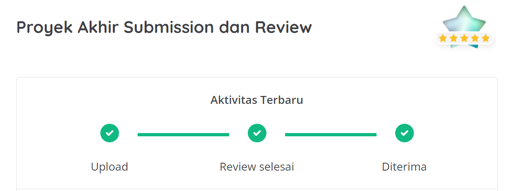

# Bookshelf API

Dicoding submission for [Belajar Membuat Aplikasi Back-End untuk Pemula dengan Google Cloud](https://www.dicoding.com/academies/342) course.

## Review

## How to Run

- Clone the repository:

      https://github.com/dzakyy04/dicoding-submission-bookshelf-api.git
 
- Install all dependencies using npm:

      npm install
    
- Start the local development server:

      npm run start

    You can now access the server at http://localhost:8900
    
## Test on Postman

- Download the Postman collection and environment:

    [Postman Bookshelf API Test Collection and Environment](https://github.com/dicodingacademy/a261-backend-pemula-labs/raw/099-shared-files/BookshelfAPITestCollectionAndEnvironment.zip)

- Extract the zip file
- Import both JSON files into Postman
